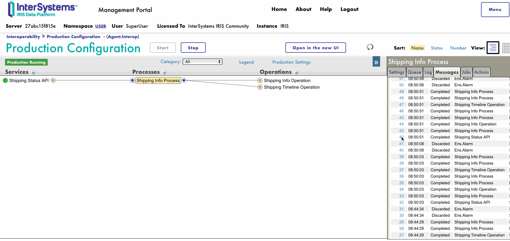
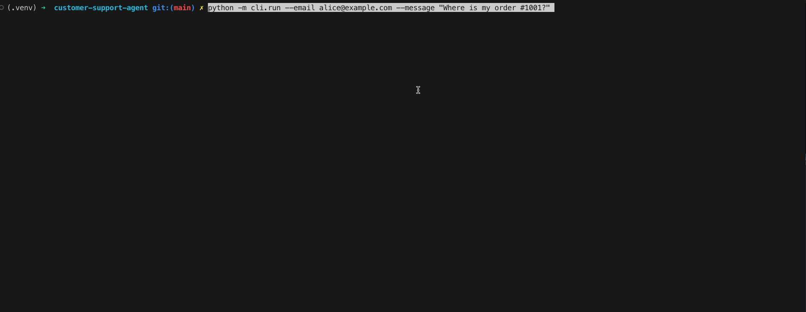
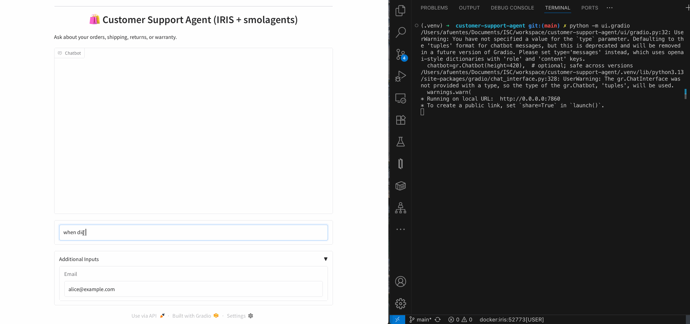

# Customer Support Agent Demo 🤖📦

Customer support agent that helps users resolve questions about orders, products, shipping, etc.

In this project you will build an **AI agent** powered by **Python [smolagents](https://huggingface.co/docs/smolagents/index)** and **InterSystems IRIS**.

---

## Why AI Agents? 🧠

AI agents are programs that use an **LLM as their "mind"** and then **call external tools** (databases, APIs, knowledge bases…) to solve real-world tasks.

👉 You *could* build such an agent **by hand**:

* Call the LLM directly from your code.
* Parse its responses.
* Figure out yourself when and how to call different tools (SQL, RAG, APIs…).
* Glue everything together.

That works… but it’s complex and fragile 😅.

Instead, you can use a **framework**. In this project we use **[smolagents](https://huggingface.co/docs/smolagents/index)**, a lightweight Hugging Face library. It lets you define **tools** and data sources, while the agent handles the reasoning.

* **CodeAgent** (used here) is a smolagents agent that plans by generating Python code step by step.
* It uses the LLM to decide which tools to call and how to combine them until it has an answer.

Think of it as a **tiny brain with a toolbox** 🧰.

---

## Project architecture 🏗️

This project relies on two key components:

* **🐍 Python** → Runs the AI agent (LLM reasoning + smolagents framework).
* **🗄️ InterSystems IRIS** → Acts as the data and integration platform:

  * Stores **structured data** (customers, orders, products, shipments).
  * Provides a **vector database** for **unstructured data** (docs, FAQs) with RAG queries.
  * Includes **interoperability** features to simulate live shipping status calls.

Together, they showcase how IRIS enables **real enterprise AI agents** that combine reasoning, structured & unstructured data, and live integrations.

---

## What you will build 🚀

You will build an AI agent that:

* Uses a LLM as its "mind" to plan and decide how to answer questions that users will ask about their orders, products, etc.
* Uses different tools to access structured data (SQL tables), unstructured data (documents using a RAG pattern) and live external information (interoperability).

---

## Requirements 📋

To run this demo you’ll need:

* 🐍 **[Python 3.9+](https://www.python.org/)**
  Runs the AI agent with smolagents and connects to IRIS.

* 🐳 **[Docker](https://docs.docker.com/get-docker/)**
  Spins up an **InterSystems IRIS** container (database + vector search + interoperability).

* 💻 **[VS Code](https://code.visualstudio.com/)** (recommended)
  For editing and exploring the Python code.

* 🔑 **[OpenAI API Key](https://platform.openai.com/)**
  Used for the LLM “mind” and also to embed documents for RAG.

---

## Setup ⚙️

### 1. Setup Python Environment

```bash
# create a local venv environment
python3 -m venv .venv
# ... for Windows users
python -m venv .venv

# activate venv
# ... for Mac or Linux users
source .venv/bin/activate
# ... for Windows users
./venv/Scripts/Activate.ps1

# install dependencies
pip3 install -r requirements.txt
```

Create a `.env` file:

* Copy `.env.example` to `.env`
* Modify it to include your OpenAI API

---

### 2. Setup InterSystems IRIS container

```bash
docker compose build
docker compose up -d
```

You can access IRIS [Management Portal](http://localhost:52773/csp/sys/UtilHome.csp) using:

* User: `superuser`
* Password: `SYS`

---

## Understanding the repo 📂

Have a look at this summary of the repo contents to understand the project:

```graphql
customer-support-agent/
├─ .env.example             # sample env file (copy to .env)
│
├─ iris/                    # InterSystems IRIS assets
│  ├─ Dockerfile            # IRIS container build
│  ├─ sql/                  # SQL scripts
│  │  ├─ schema.sql         # creates tables for Customer Support use case
│  │  ├─ load_data.sql      # loads CSVs into tables
│  │  └─ truncate.sql      
│  ├─ data/                 # data: customer, orders, etc.
│  ├─ docs/                 # unstructured Knowledge Base (RAG content)
│  └─ src/                  # IRIS classes. Simulates live shipping status interoperability 
│
├─ agent/                   # the AI agent (Python) + tools
│  ├─ customer_support_agent.py   # wraps smolagents CodeAgent + tools
│  └─ tools/
│     ├─ sql_tool.py              # SQL tools
│     ├─ rag_tool.py              # RAG tools
│     └─ shipping_tool.py         # calls IRIS interoperability
│
├─ db/                      # database adapters & helpers
├─ cli/                     # terminal frontend
├─ ui/                      # lightweight web UI (Gradio)
└─ scripts/                 # utility scripts
```

---

## Load SQL Data 🗄️

Before running the agent, we must create the tables and insert some data.
This will be the structured data that the agent will query to answer user questions.

Run this SQL sentences in IRIS [SQL Explorer](http://localhost:52773/csp/sys/exp/%25CSP.UI.Portal.SQL.Home.zen?$NAMESPACE=USER) or using your favorite SQL client.

```sql
LOAD SQL FROM FILE '/app/iris/sql/schema.sql' DIALECT 'IRIS' DELIMITER ';'
```

```sql
LOAD SQL FROM FILE '/app/iris/sql/load_data.sql' DIALECT 'IRIS' DELIMITER ';' 
```

Check the data you have just inserted and get yourself familiar with the tables.
Here are some simple queries you can try:

```sql
-- List all customers
SELECT * FROM Agent_Data.Customers;

-- Get all orders for a given customer
SELECT o.OrderID, o.OrderDate, o.Status, p.Name AS Product
FROM Agent_Data.Orders o
JOIN Agent_Data.Products p ON o.ProductID = p.ProductID
WHERE o.CustomerID = 1;

-- Check shipment info for an order
SELECT * FROM Agent_Data.Shipments WHERE OrderID = 1001;

-- See products with their warranty
SELECT Name, WarrantyMonths FROM Agent_Data.Products;

-- Find orders that are still Processing
SELECT * FROM Agent_Data.Orders WHERE Status = 'Processing';
```

---

## Load and embed non structured data 📚

The agent will be able also to query non structured data using a RAG (Retrieval Augmented Generation) pattern.
For that, we will be leveraging InterSystems IRIS Vector Search features.

We will embed the data using OpenAI `text-embedding-3-small` model.
We will leverage an InterSystems IRIS feature that allows us to setup embedding directly in the database.

```sql
INSERT INTO %Embedding.Config (Name, Configuration, EmbeddingClass, VectorLength, Description)
  VALUES ('my-openai-config', 
          '{"apiKey":"your-openai-api-key-here", 
            "sslConfig": "llm_ssl", 
            "modelName": "text-embedding-3-small"}',
          '%Embedding.OpenAI', 
          1536,  
          'a small embedding model provided by OpenAI') 
```

Now, run script that loops over documents and records that needs to be embedded

```bash
python scripts/embed_sql.py
```

After that have a look at the tables and check that embeddings are now included.

---

## Interoperability 🔗

One of the **most powerful features of InterSystems IRIS** is its **Interoperability framework**.
It allows you to seamlessly connect your solution to **other systems, APIs, and services** in a reliable, monitored, and traceable way.

In this demo, we included a **mock shipping service** that shows how an agent can call a live API to retrieve status and timeline information:

```bash
curl --header "Content-Type: application/json" \
  --request POST \
  --data '{"orderStatus":"Processing","trackingNumber":"DHL7788"}' \
  http://localhost:52773/api/shipping/status
```

This information can also be consumed by the agent.

✨ And since IRIS has a built-in **Visual Trace** viewer, you can actually see each message flowing through the system.



---

## Understanding the agent 🤖

The agent is a smolagents **CodeAgent**:

* It will use an mini OpenAI LLM model as a mind to plan and decide which tools use.
* It will run several steps and use different tools to try to resolve a user question.

➡️ Want to see how it works under the hood? Check out these key files:

* [agent/customer\_support\_agent.py](agent/customer_support_agent.py) → main agent setup
* [agent/tools/sql\_tool.py](agent/tools/sql_tool.py) → SQL queries (orders, products, ranges)
* [agent/tools/rag\_tool.py](agent/tools/rag_tool.py) → RAG queries with IRIS Vector Search
* [agent/tools/shipping\_tool.py](agent/tools/shipping_tool.py) → calls the IRIS interoperability API

Feel free to open them and explore the code — they’re short, simple, and quite fun to read 👀.

---

## Running the agent ▶️

You can run the agent in three different ways:

### 🔹 One-shot mode

Run a single question + get a single answer. Perfect for quick tests.

```bash
python -m cli.run --email alice@example.com --message "Where is my order #1001?"

python -m cli.run --email alice@example.com --message "Show electronics that are good for travel"

python -m cli.run --email alice@example.com --message "Was my headphones order delivered, and what’s the return window?"

python -m cli.run --email alice@example.com --message "Find headphones under $120 with ANC"

python -m cli.run --email alice@example.com --message "If my order is out of warranty, what options do i have?"

```



---

### 🔹 Interactive CLI

Start a small session where you can type multiple questions in a row.

```bash
python -m cli.run --email alice@example.com
```

---

### 🔹 Web UI (Gradio)

A lightweight chat UI with Gradio, so you can talk to the agent in your browser.

```bash
python -m ui.gradio
```

Then open the UI in http://localhost:7860



---

## 🎉 Wrap up

* You’ve just set up an **AI-powered customer support agent** that combines **LLM reasoning**, **structured SQL data**, **unstructured docs with RAG**, and **live interoperability APIs**.
* This is a **technical repo**, but hey, customer support is never boring when you have an AI sidekick 🤖.
* Next steps? Extend the schema, add more tools, or plug it into your own data sources!

